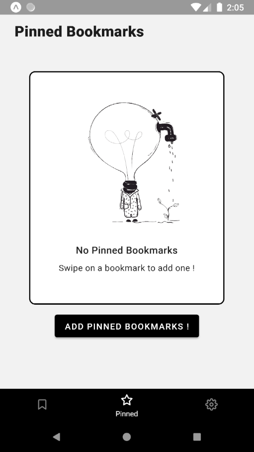

# Ribbon

## A bookmark manager app

This is an application which aim to help you complete reading your bookmarks.

## Preview

  

  

  

## Features

- 📚 Manage your Reddit saved posts
- 🔔 Get reminders for pinned bookmarks
- 🔎 Filter through all your bookmarks

## Services

The goal is to centralize all bookmarks from different services but unfortunately it's not that easy since they did not provide an easy/legal way to do so.

Supported services :
- Reddit (Saved)

Ideas :
- GitHub (Stars)

Not possible :
- Twitter (Bookmark) **API endpoint closed**
- YouTube (Watch later) **API endpoint closed**
